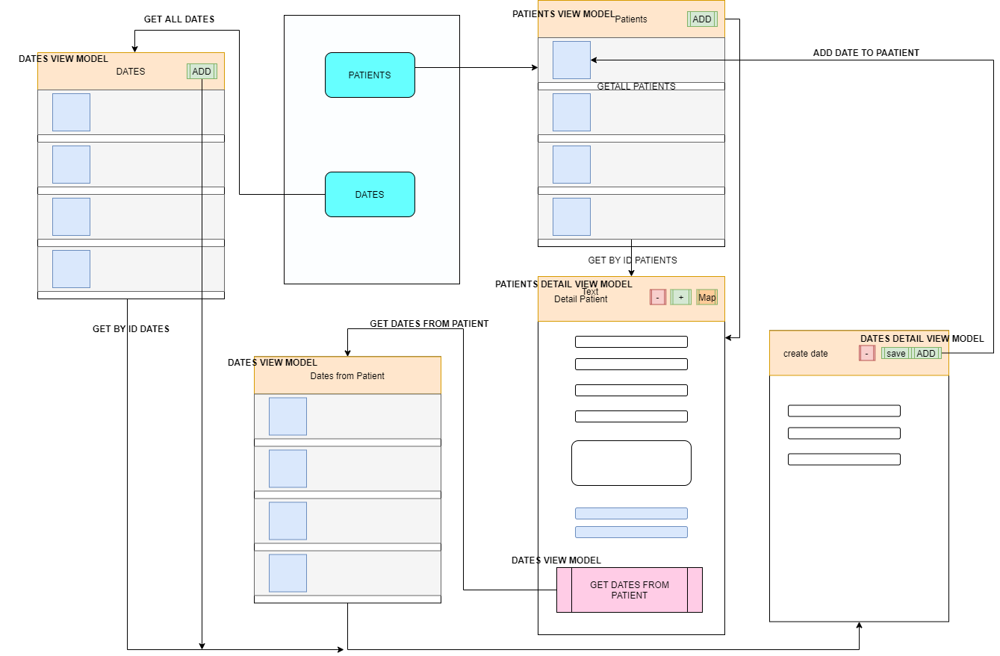

# Dentist-AzureSQL

This is an App in Xamarin.Forms for patient management of a dentist, the information will be
saved in AzureSQL and the API will be hosted in Azure services.
The modules and functionalities are:
- CRUD of patients. Patients are saved with their name, photograph (taken with the
camera or selected from the galery) and address (coordinates).
- CRUD dating. Appointments are saved with the date and time of the appointment, the patient to be attended.
- Map displaying the location of the patient's home.

## Structure diagram

## Requirements
* To use the map, it is necessary to create a [Google Cloud Platform](https://console.cloud.google.com/getting-started) account and enable an API KEY from Maps SDK for Android, after that it must be placed in the android manifest file.
* To make it work it is necessary to have an Azure account to access its services, through AzureSQL create a database according to the [Destist database file](https://github.com/AndreeJimenez/Dentist-AzureSQL/blob/master/DentistStorageProcedures.txt), obtaining a connection string that must be placed in the API Model files and use the azure app services to deploy the API.

## Notes
* To access the API -> [knatb GitHub](https://github.com/knatb/AppDentistSQL)
